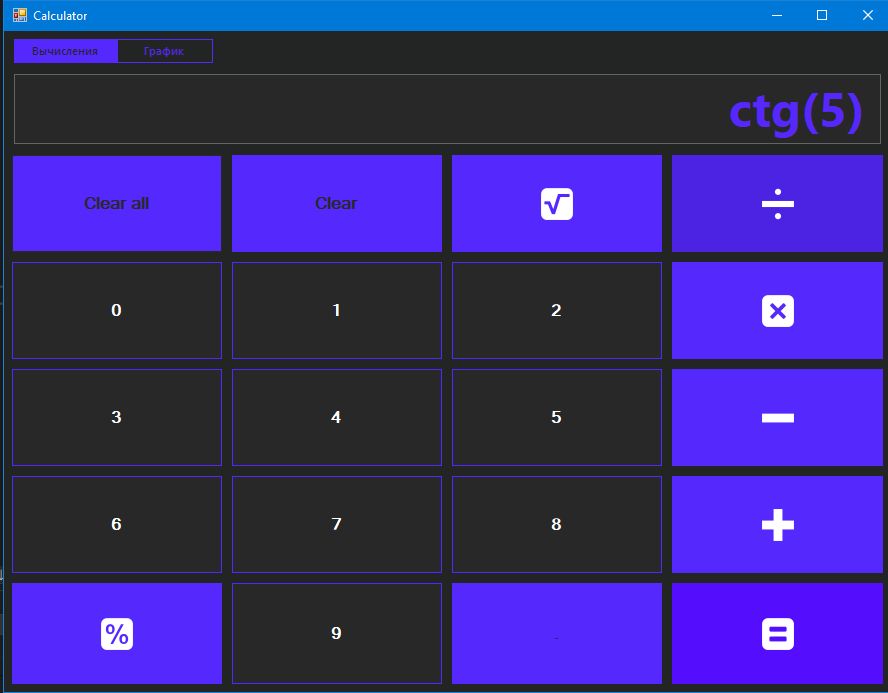
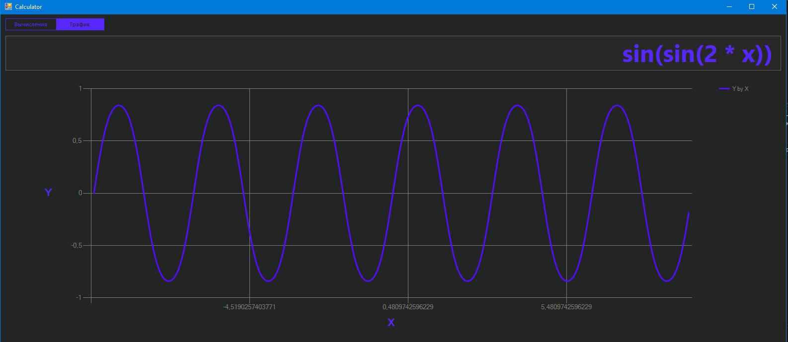

# Calculator на C# с использованием WinForms

Проект Calculator на C# с использованием WinForms предоставляет удобный интерфейс для выполнения базовых математических операций, а также для вычисления sin, cos, tg, ctg, выражений с корнем и возведения в степень.

## Основные возможности:
- Сложение
- Вычитание
- Умножение
- Деление
- Вычисление sin, cos, tg, ctg
- Вычисление выражений с корнем и возведения в степень

## Скриншот основного интерфейса:

## Графики с аргументом x:
Помимо базовых операций, Calculator позволяет изображать графики функций с аргументом x.

## Скриншот графика:

### Инструкции по использованию:
1. Запустите приложение Calculator.exe.
2. Введите необходимые числа и выберите операцию.
3. Для вычисления trigonometric функций или выражений с корнем/степенью, используйте соответствующие кнопки.
4. Для построения графика, выберите соответствующий раздел и введите функцию в виде f(x).
5. Нажмите кнопку "Вычислить" или "Построить график" соответственно.

### Заметка:
Скриншоты приложены для визуального представления интерфейса и функционала.
